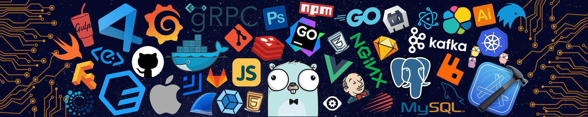

<!--
Projects inspiration

https://github.com/durgeshsamariya/awesome-github-profile-readme-templates/blob/master/templates/donPabloNow.md

https://github.com/durgeshsamariya/awesome-github-profile-readme-templates/tree/master/templates

 -->

 

    

        &nbsp;&nbsp;&nbsp;&nbsp;
        
Welcome To My Profile

    

    

    <a href="mailto:difallahadam2003@gmail.com" target="_blank">
        &nbsp;   
    </a>
    <a href="https://www.linkedin.com/in/adam-pomposelli/" target="_blank">
        &nbsp;
    </a>
    &nbsp;

 

 

I've been a programming chameleon for 5 years now! 🦎 I've dabbled in everything from web development 🕸️, video games 🎮, blockchain ⛓️, testing 🧪, and even some embedded programming 🤖. I'm like a jack-of-all-trades, but for coding! 💻

I've had to learn so many programming languages 🗣️, from C, C++, C#, Javascript, Typescript, Java, PHP, and more! It's like a linguistic adventure, but instead of learning new languages to talk to people, I'm learning new languages to talk to computers! 🤓

After spending 4 years in game development 🎮, I decided to branch out and learn full-stack web development 🕸️ and blockchain development ⛓️ for 2 years. Because why not? 🤷‍♀️

Then, I started my graduate studies at ESGI and had to find a job in IT to validate my semester. I applied for a web developer position, but guess what? I ended up working as a QA Automation Tester for 6 months! 😂

But hey, it's all good! It taught me even more programming principles and engineering concepts. Plus, I'm always up for a new challenge! Bring it on! 💪

 

    

        
    

 
 

Programming Languages 👨‍💻

 

&nbsp;&nbsp;
&nbsp;&nbsp;
&nbsp;&nbsp;
&nbsp;&nbsp;
&nbsp;&nbsp;
&nbsp;&nbsp;
&nbsp;&nbsp;
&nbsp;&nbsp;
&nbsp;&nbsp;
&nbsp;&nbsp;

  

<!--

    

   -->

Frameworks X Libraries ⇆ FrontEnd && Backend

 

    &nbsp;&nbsp;
    &nbsp;&nbsp;
    &nbsp;&nbsp;
    &nbsp;&nbsp;
    &nbsp;&nbsp;
    &nbsp;&nbsp;
    &nbsp;&nbsp;
    &nbsp;&nbsp;
    &nbsp;&nbsp;
    &nbsp;&nbsp;
    &nbsp;&nbsp;
    &nbsp;&nbsp;
&nbsp;&nbsp;
&nbsp;&nbsp;
&nbsp;&nbsp;
&nbsp;&nbsp;
&nbsp;&nbsp;
&nbsp;&nbsp;
&nbsp;&nbsp;

  

Softwares & Apps 🎨

 

    &nbsp;&nbsp;
    &nbsp;&nbsp;
    &nbsp;&nbsp;
    &nbsp;&nbsp;
    &nbsp;&nbsp;
    &nbsp;&nbsp;
    &nbsp;&nbsp;
    &nbsp;&nbsp;
    &nbsp;&nbsp;
    &nbsp;&nbsp;
    &nbsp;&nbsp;
    &nbsp;&nbsp;
    &nbsp;&nbsp;

  

⚡ IOT & OS ⚙️

 

    </img>

 

    &nbsp;&nbsp;
    &nbsp;&nbsp;
    &nbsp;&nbsp;
    &nbsp;&nbsp;
    &nbsp;&nbsp;
    
    

 

Creative 🎨

 

    &nbsp;&nbsp;
    &nbsp;&nbsp;
    &nbsp;&nbsp;
    &nbsp;&nbsp;
    &nbsp;&nbsp;
    &nbsp;&nbsp;

 
 

 

 

 
 

 
 
 

Profile Views 👀

 

 

    

 
 

If you like my projects, Give them a ⭐ and Share !

Made with ❤️ by APZdev | Adam

    

